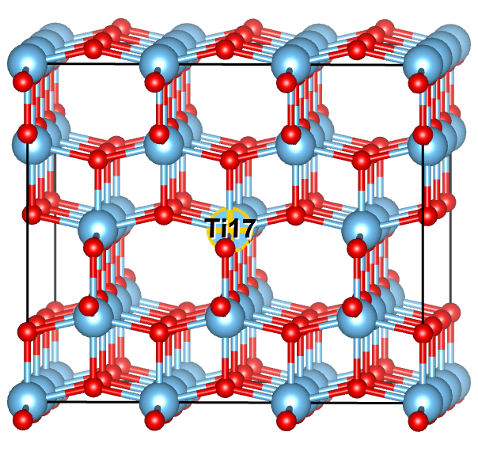
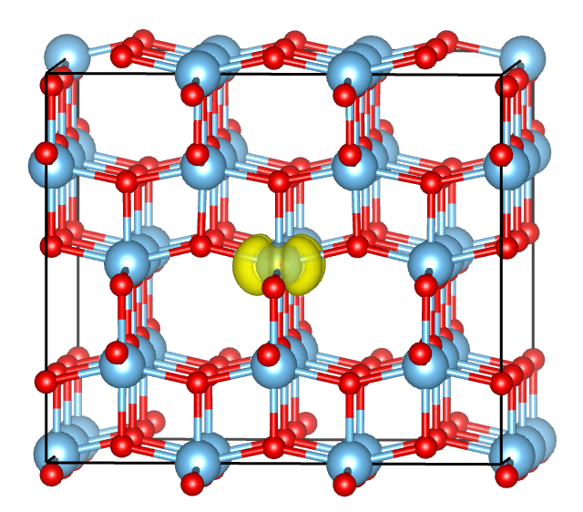
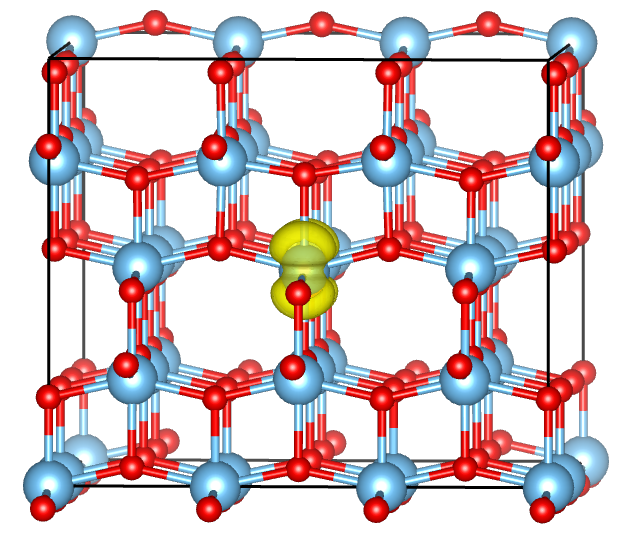
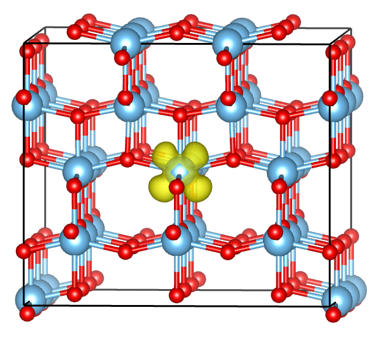
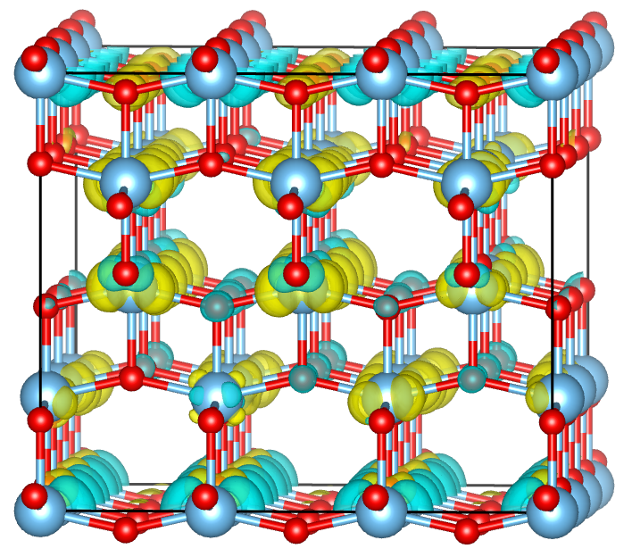

## Anatase TiO2
### Introduction and Structure
The bulk anatase structure is shown below and is orthorhombic in nature (space group I41/amd). It possess six-coordinate d0 Ti(IV) ions in a distorted octahedral environment and three-coordinate oxygen ions in a trigonal planar arrangement.



The advantage of using the anatase polymorph over the more stable rutile form is that no rotation of the cell (or rotation of the occupation matrix) is required to ensure that the Ti–O bonds lie in the same planes as the principal axes, which is not the case for rutile.

### Folders
Folders contain:
```
|_________OCC_change
| |_______5-5 to 9-9:    Fixing occupation matrix elements (5,5), (6,6), (7,7), (8,8) and (9,9).
| | |_____1-OCC_OPT:     Fixing occupation and relax
| | |_____2-OCC_SCF:     Fixing occupation and run SCF
| | |_____3-OPT:         OPT using structure from 1-OCC_OPT and WAVCAR from 2-OCC_SCF
| | |_____4-SCF:         SCF using structure from 3-OPT and WAVCAR from 2-OCC_SCF
|
|_________SCF_unitcell:  SCF using structure from OPT_unitcell, with no occupation manipulation.
|_________OPT_unitcell:  OPT of unitcell with no occupation manipulation.
|_________OPT_primitive: OPT of primitive cell with no occupation manipulation.
```

---------------

### Result

#### With Occupation control

Spin density of `5-5`, `dxy` orbital:



Spin density of `6-6`, `dyz` orbital:



Spin density of `8-8`, `dxz` orbital:



Localization in (7,7) and (9,9) are unsuccessful, the final results resemble that without occupation control.

#### Without Occupation control

Spin density of without occupation control. (Both relax and SCF calculations are done without occupation fix.)



The added electron is localized on Ti atoms, resembling a '5-5' orbital with a small rotation.

#### Total energy

| orbital         |        total energy (eV)         |           localization           |
|:---------------:|:--------------------------------:|:--------------------------------:|
| `5-5`   (dxy)   |         -862.62404494            |              Achieved            |
| `6-6`   (dyz)   |         -862.54905867            |              Achieved            |
| `7-7`   (-)     |         -862.75012503            |            Unsuccessful          |
| `8-8`   (dxz)   |         -862.54908299            |              Achieved            |
| `9-9`   (-)     |         -862.75010405            |            Unsuccessful          |
| `no_fix`(-)     |         -862.74933029            |            Unsuccessful          |
